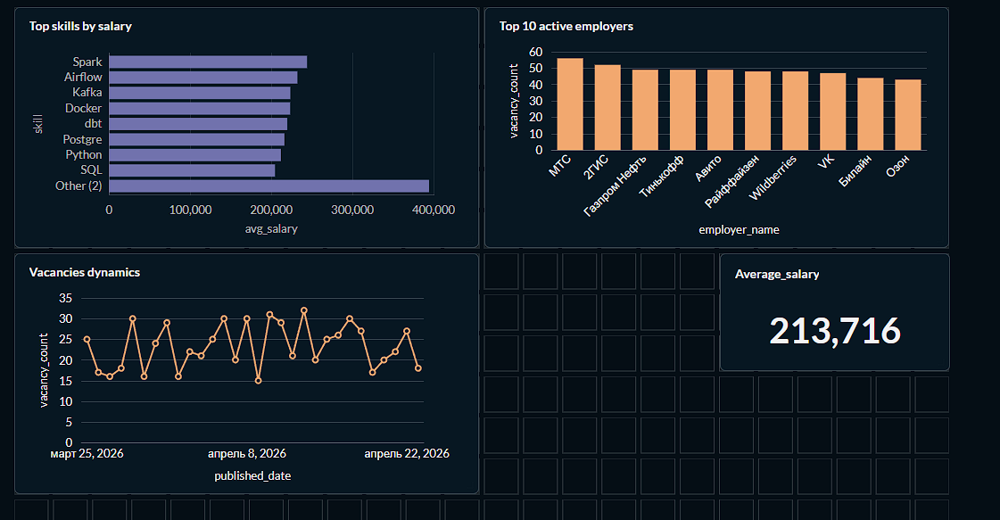

## Dashboard

Metabase dashboard for vacancy analysis:

**key metrics:**
- average salary
- top-10 skills by salary
- top-10 active employers
- vacancy publication dynamics

All the vacancies are generated

## Skills Demonstrated

**Data Engineering:**
- ETL pipeline design and implementation
- Workflow orchestration (Apache Airflow)
- Data modeling (staging → marts architecture)
- SQL transformations (dbt)

**Analytics:**
- Exploratory Data Analysis (pandas, matplotlib, seaborn)
- Statistical analysis and hypothesis testing
- BI dashboard development (Metabase)
- Data visualization best practices

**Infrastructure:**
- Docker & docker-compose
- PostgreSQL database management
- Git version control